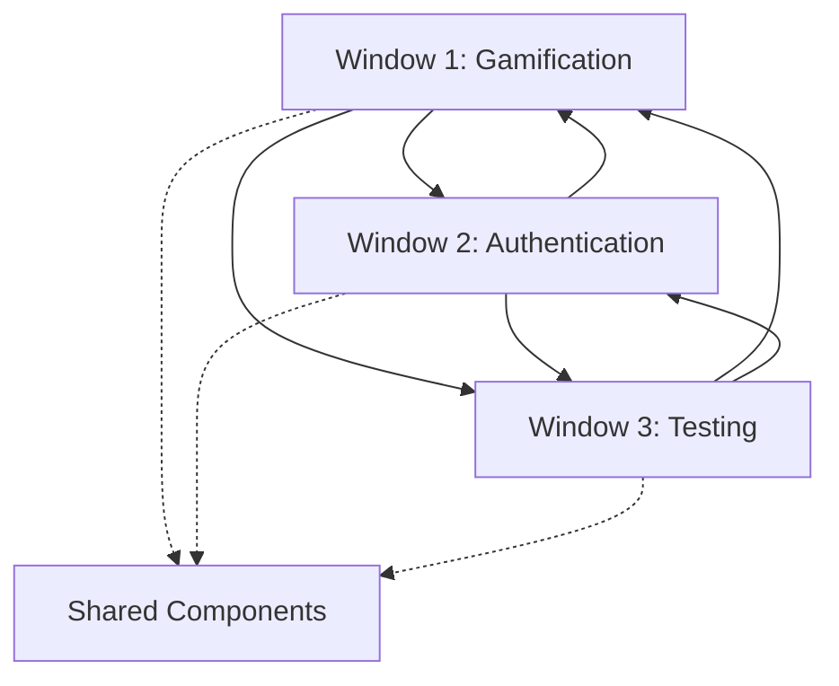

# 🔄 Cross-Window Dependencies & Integration Matrix
**Project**: CourseScout 3-Window Parallel Development  
**Purpose**: Coordinate dependencies and integration points across all windows  
**Last Updated**: Ready for execution

## **🎯 Dependency Overview**

### **Critical Integration Points**
The three windows have strategic integration dependencies that must be carefully managed to ensure successful parallel execution without blocking conflicts.

---

## **📋 Detailed Dependency Matrix**

### **🎮 Window 1 (Gamification) Dependencies**

#### **Requires FROM Window 2 (Authentication):**
- **User Identity System**: Social challenges need authenticated user profiles
- **Friend Network Management**: Social features require user relationship data
- **Role-Based Permissions**: Premium gamification features need subscription validation
- **Profile Integration**: Achievement tracking needs user profile storage
- **Social Graph**: Friend connections for challenge invitations

#### **Provides TO Window 2 (Authentication):**
- **Engagement Metrics**: User activity data for authentication analytics
- **Achievement Data**: Badge/milestone data for user profiles
- **Social Context**: Friend networks and challenge histories for profiles

#### **Requires FROM Window 3 (Testing):**
- **Performance Validation**: Load testing for real-time leaderboard performance
- **Integration Testing**: End-to-end testing for social challenge workflows
- **UI Testing**: Automated testing for gamification interfaces

#### **Provides TO Window 3 (Testing):**
- **Test Scenarios**: Complex gamification workflows for testing
- **Performance Requirements**: Real-time update performance specifications
- **User Journey Testing**: Social interaction test cases

---

### **🔐 Window 2 (Authentication) Dependencies**

#### **Requires FROM Window 1 (Gamification):**
- **Social Profile Data**: User achievements and gaming preferences for profiles
- **Engagement Context**: Activity data for authentication analytics

#### **Provides TO Window 1 (Gamification):**
- **User Authentication**: Secure user identity for all gamification features
- **Profile Management**: User profile system for achievement tracking
- **Friend Systems**: Social network management for challenges
- **Premium Validation**: Subscription status for premium gamification features
- **Role-Based Access**: Permission system for different gamification tiers

#### **Requires FROM Window 3 (Testing):**
- **Security Testing**: Penetration testing for authentication flows
- **Load Testing**: Authentication system performance under high load
- **Compliance Testing**: GDPR and security compliance validation

#### **Provides TO Window 3 (Testing):**
- **Security Test Cases**: Authentication security scenarios
- **Compliance Requirements**: GDPR and SOC 2 testing specifications
- **Performance Baselines**: Authentication performance requirements

---

### **🔧 Window 3 (Testing) Dependencies**

#### **Requires FROM Window 1 (Gamification):**
- **Feature Specifications**: Gamification features to test
- **Performance Requirements**: Real-time performance expectations
- **User Workflows**: Social interaction patterns for testing

#### **Requires FROM Window 2 (Authentication):**
- **Security Specifications**: Authentication security requirements
- **Compliance Requirements**: GDPR and SOC 2 specifications
- **User Management**: Test user creation and management

#### **Provides TO Window 1 (Gamification):**
- **Performance Testing**: Load testing results and optimization recommendations
- **Quality Validation**: Code quality and coverage reports
- **Integration Testing**: End-to-end workflow validation

#### **Provides TO Window 2 (Authentication):**
- **Security Validation**: Security testing results and compliance confirmation
- **Performance Testing**: Authentication load testing and optimization
- **Quality Assurance**: Code coverage and security scan results

---

## **🔄 Integration Checkpoints**

### **Day 1: Initial Setup**
- **All Windows**: Establish shared component interfaces
- **Window 3**: Set up testing infrastructure for Window 1 & 2 components
- **Dependency Check**: Validate no blocking dependencies exist for parallel start

### **Day 2: Mid-Development Sync**
- **Cross-Window Integration**: Validate interface compatibility
- **Window 1 ↔ Window 2**: User authentication integration for social features
- **Window 3**: Begin integration testing for completed components
- **Risk Assessment**: Identify any emerging integration issues

### **Day 3: Feature Freeze & Integration**
- **Window 1 & 2**: Feature freeze, begin final integration
- **Window 3**: Intensive integration testing begins
- **Cross-Window Validation**: End-to-end workflow testing
- **Performance Validation**: Load testing integrated features

### **Day 4: Final Integration & Validation**
- **All Windows**: Complete integration and final testing
- **Window 3**: Complete test suite execution and validation
- **Integration Sign-off**: All cross-window dependencies validated
- **Production Readiness**: Final go/no-go decision

---

## **🤝 Shared Component Coordination**

### **ServiceContainer (All Windows)**
**Owner**: Shared responsibility  
**Integration Points**:
- **Window 1**: Register gamification services (RatingEngine, SocialChallenge, Achievement)
- **Window 2**: Register authentication services (Auth, Profile, Biometric, Session)
- **Window 3**: Mock service registration for comprehensive testing

**Coordination Strategy**:
- **Service Registration Order**: Authentication → Gamification → Testing mocks
- **Dependency Resolution**: Lazy loading to avoid circular dependencies
- **Testing Integration**: Mock services override real services in test environment

### **SecurityService (Primary: Window 2, Enhanced: Window 1, Tested: Window 3)**
**Owner**: Window 2  
**Integration Points**:
- **Window 1**: User validation for social challenges, premium feature access
- **Window 2**: Core authentication, authorization, and session management
- **Window 3**: Comprehensive security testing and compliance validation

**Coordination Strategy**:
- **Interface Stability**: Window 2 provides stable security interface
- **Extension Pattern**: Window 1 extends security for gamification-specific needs
- **Testing Coverage**: Window 3 ensures 100% security function coverage

### **RevenueService (Enhanced by Windows 1 & 2, Tested by Window 3)**
**Owner**: Existing (already implemented)  
**Integration Points**:
- **Window 1**: Premium gamification feature billing, tournament revenue
- **Window 2**: White label authentication billing, enterprise SSO setup fees
- **Window 3**: Revenue flow testing and validation

**Coordination Strategy**:
- **Billing Integration**: Both windows add revenue events to existing system
- **Revenue Attribution**: Clear tagging for revenue source tracking
- **Testing Validation**: Comprehensive revenue flow testing

### **HapticFeedbackService (Enhanced: Window 1, Tested: Window 3)**
**Owner**: Existing (already implemented)  
**Integration Points**:
- **Window 1**: Enhanced haptic patterns for gamification (achievements, milestones)
- **Window 3**: Haptic feedback testing and user experience validation

**Coordination Strategy**:
- **Pattern Extension**: Window 1 adds new haptic patterns to existing service
- **Apple Watch Integration**: Enhanced Watch haptic coordination
- **Testing Coverage**: User experience testing for all haptic interactions

---

## **⚠️ Risk Mitigation Strategies**

### **High-Risk Dependencies**

#### **Risk 1: Authentication Blocking Gamification**
**Impact**: High - Social features can't function without user authentication  
**Mitigation**: 
- Window 2 delivers basic authentication by Day 1 end
- Window 1 uses mock authentication service until integration
- Parallel development of auth interfaces and gamification logic

#### **Risk 2: Testing Infrastructure Delays**
**Impact**: Medium - Could delay final validation and deployment  
**Mitigation**:
- Window 3 sets up basic CI/CD pipeline on Day 1
- Incremental testing throughout development, not just at end
- Parallel test development alongside feature development

#### **Risk 3: Performance Integration Issues**
**Impact**: Medium - Real-time features might not meet performance requirements  
**Mitigation**:
- Early performance testing with realistic load simulation
- Performance budgets established and monitored continuously
- Fallback strategies for performance edge cases

### **Medium-Risk Dependencies**

#### **Risk 4: UI/UX Integration Conflicts**
**Impact**: Medium - User experience might feel fragmented  
**Mitigation**:
- Shared UI component library and design system
- Regular UX reviews across all windows
- Consistent navigation and interaction patterns

#### **Risk 5: Database Schema Conflicts**
**Impact**: Low-Medium - New features might require schema changes  
**Mitigation**:
- Database migration strategy coordinated across windows
- Schema change approval process
- Backward compatibility requirements

---

## **🚀 Success Criteria for Integration**

### **Technical Integration**
- [ ] **Service Container**: All services registered without conflicts
- [ ] **API Compatibility**: All service interfaces working across windows
- [ ] **Database Integration**: No schema conflicts or data corruption
- [ ] **Performance Requirements**: All integration points meeting performance targets
- [ ] **Security Integration**: Authentication working seamlessly with gamification

### **User Experience Integration**
- [ ] **Seamless Workflows**: User can complete end-to-end workflows without friction
- [ ] **Consistent UI/UX**: All features feel like part of cohesive application
- [ ] **Apple Watch Sync**: Seamless synchronization between iPhone and Watch
- [ ] **Premium Features**: Subscription-based features working correctly
- [ ] **Social Features**: Friend systems and challenges working with authentication

### **Business Integration**
- [ ] **Revenue Tracking**: All revenue events properly attributed and tracked
- [ ] **Analytics Integration**: User engagement and business metrics flowing correctly
- [ ] **Enterprise Features**: White label and enterprise features working end-to-end
- [ ] **Compliance**: GDPR, security, and business compliance validated
- [ ] **Scalability**: System handling expected enterprise customer load

---

## **📊 Integration Monitoring**

### **Real-Time Integration Dashboard**
- **Service Health**: Status of all cross-window service integrations
- **Performance Metrics**: Real-time performance of integrated features
- **Error Tracking**: Integration-specific error monitoring and alerting
- **User Experience**: End-to-end user workflow success rates
- **Business Metrics**: Revenue and engagement metrics across integrated features

### **Daily Integration Reports**
- **Dependency Status**: Progress on all cross-window dependencies
- **Integration Test Results**: Pass/fail status for integration test suites
- **Performance Benchmarks**: Performance metrics for integrated features
- **Issue Tracking**: Integration-specific issues and resolution status
- **Risk Assessment**: Daily risk evaluation and mitigation status

---

## **📞 Communication Protocol**

### **Daily Standups (Async)**
- **Window Leads**: Report on dependency progress and blockers
- **Integration Status**: Update on cross-window integration points
- **Issue Resolution**: Coordination on integration issues
- **Risk Updates**: New risks or mitigation strategy changes

### **Integration Sync Points**
- **Day 1 End**: Validate parallel development feasibility
- **Day 2 Mid**: Check integration readiness and address issues
- **Day 3 End**: Validate feature freeze and integration testing
- **Day 4 End**: Final integration sign-off and production readiness

### **Escalation Protocol**
1. **Window-to-Window**: Direct coordination between window leads
2. **Technical Escalation**: Architecture team consultation for complex issues
3. **Business Escalation**: Product team involvement for scope or timeline issues
4. **Executive Escalation**: Senior leadership for critical blocking issues

---

**🎯 Integration Success**: Seamless coordination between all three windows resulting in a cohesive, high-performance, enterprise-ready golf platform that feels like a single unified application rather than three separate feature sets.